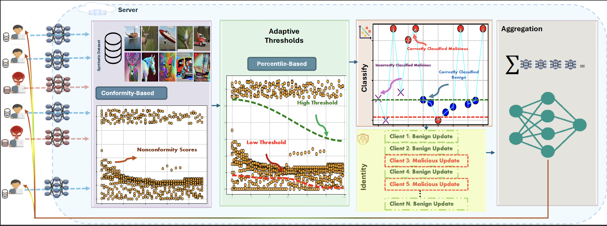

<h1>SD-CSFL: A Synthetic Data-Driven Conformity Scoring Framework for Robust Federated Learning</h1>
<h3>Official Implementation — WACV 2026 (Algorithms Track)</h3>

  

This repository contains the official implementation of the WACV 2026 paper:
 
<b>“SD-CSFL: A Synthetic Data-Driven Conformity Scoring Framework for Robust Federated Learning.”</b>

<h2>Overview</h2>

SD-CSFL is a unified defense framework that enhances the robustness of Federated Learning (FL) against:

<ul>
  <li>Gradient manipulation attacks (IPM, ALIE)</li>
  <li>Backdoor attacks (A3FL, F3BA, CerP)</li>
  <li>Heterogeneous (Non-IID) client distributions</li>
  <li>Privacy leakage from validation data</li>
</ul>

<b>Core Idea</b>

A clean <b>synthetic calibration dataset</b> is used to compute 
<b>entropy-based nonconformity scores</b> for each client model.  
These scores are evaluated using <b>adaptive percentile thresholds</b> to classify clients as benign or malicious.
Only benign updates are aggregated into the global model, enabling a unified and privacy-preserving anomaly detection mechanism.

<h2>Abstract</h2>

Federated Learning remains highly vulnerable to gradient manipulation and backdoor attacks, especially under heterogeneous client data. 
SD-CSFL introduces a <b>synthetic data–driven entropy-based conformity scoring mechanism</b>, combined with 
<b>adaptive percentile thresholding</b> and <b>stratified calibration</b>, enabling robust and privacy-preserving detection of malicious updates. 
Experiments on <b>CIFAR-10</b> and <b>Birds-525</b> show up to <b>35% higher detection</b> and <b>80% backdoor success reduction</b> over existing defenses.

<h2>Method Summary</h2>

<h3>1. Synthetic Calibration Data</h3>
<ul>
    <li>Generated using Stable Diffusion v2.</li>
    <li>Includes artistic, non-photorealistic, and abstract variations.</li>
    <li>Designed to amplify entropy sensitivity for improved anomaly detection.</li>
</ul>

<h3>2. Entropy-Based Nonconformity Score</h3>
<ul>
    <li>Each client model is evaluated on a shared synthetic dataset.</li>
    <li>Mean entropy across all samples forms the conformity (nonconformity) score.</li>
    <li>Higher scores indicate uncertainty or potentially malicious behavior.</li>
</ul>

<h3>3. Adaptive Percentile Thresholding</h3>
<ul>
    <li>Thresholds are computed using symmetric quantiles (e.g., 30%–70%).</li>
    <li>Maintains a controlled false-positive rate under Non-IID settings.</li>
    <li>Thresholds are updated every communication round to adapt to score shifts.</li>
</ul>

<h3>4. Aggregation</h3>
<ul>
    <li>Only benign client updates (scores within threshold bounds) are aggregated.</li>
    <li>Malicious clients may receive a perturbed global model to reduce attack influence.</li>
</ul>

<h2>Datasets</h2>
<ul>
  <li><b>Birds-525 Real Dataset:</b> 
    <a href="https://drive.google.com/file/d/1NvVfcrvXNOzX8mz1A-yhudegYJZXprSJ/view">Google Drive Link</a>
  </li>

  <li><b>Birds-Synth (Synthetic Calibration Dataset):</b>
    <a href="https://drive.google.com/file/d/10akkldmavU_CxsMlWacL0Lq0Nr9eQuz6/view?usp=drive_link">Google Drive Link</a>
  </li>

  <li><b>CIFAR-10 Real Dataset:</b>
    <a href="https://www.cs.toronto.edu/~kriz/cifar.html">Official CIFAR-10 Link</a>
  </li>

  <li><b>CIFAR-10-Synth (Synthetic Calibration Dataset):</b>
    <a href="https://drive.google.com/file/d/10akkldmavU_CxsMlWacL0Lq0Nr9eQuz6/view?usp=drive_link">Google Drive Link</a>
  </li>

  <li><b>Synthetic Dataset Generator (Stable Diffusion + Pipelines):</b>  
    <a href="https://github.com/A-Kerim/Synthetic-Data-Usability">https://github.com/A-Kerim/Synthetic-Data-Usability</a>
  </li>
</ul>

<h2>Getting Started</h2>
<ol>
  <li>Clone this repository to your local machine.</li>

  <li>Install the required dependencies:</li>
  <pre><code>pip install -r requirements.txt</code></pre>

  <li>Download the datasets using the links above.</li>

  <li>Adjust experiment settings in <code>configs/</code> based on your needs.</li>

<h2>License</h2>

The SD-CSFL framework and the associated synthetic datasets are made freely available for academic and non-commercial research purposes.  
If you use the framework or the datasets, please cite our WACV 2026 paper. 

<h2>Acknowledgments</h2>

This work was supported by the Saudi Arabian Ministry of Education, 
the Saudi Arabian Cultural Bureau in London, and Umm Al-Qura University.  
We also thank the High-End Computing (HEC) facility at Lancaster University for providing essential computational resources.

